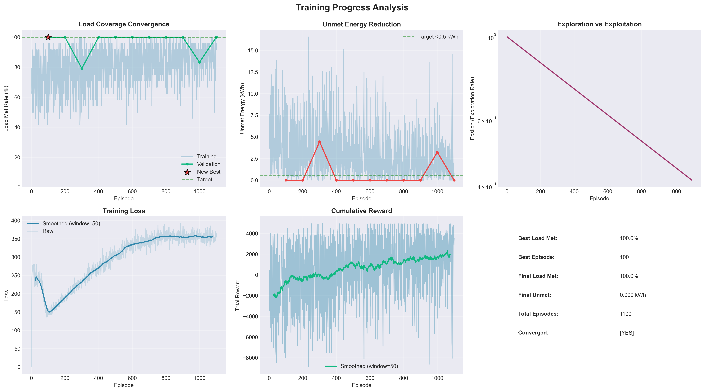
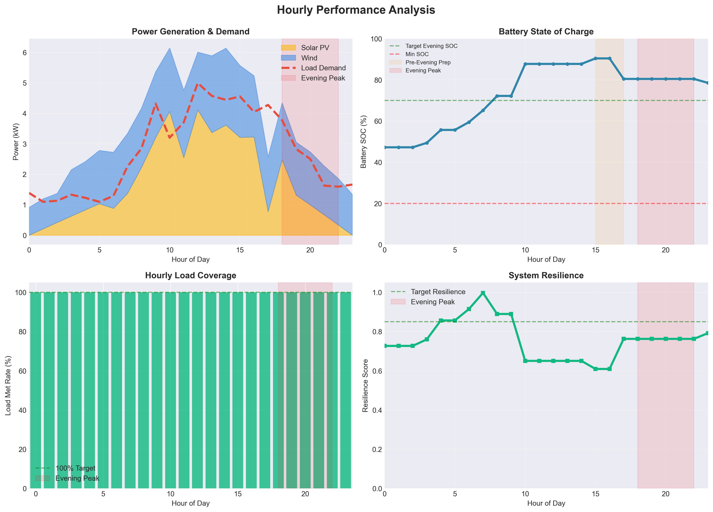
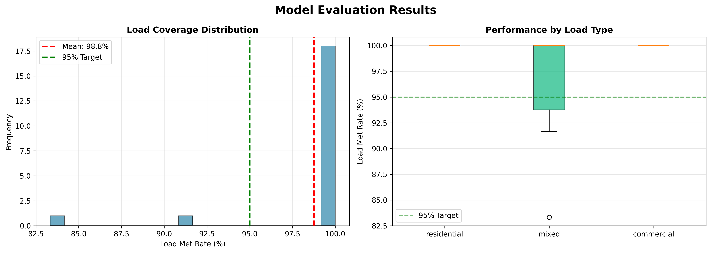
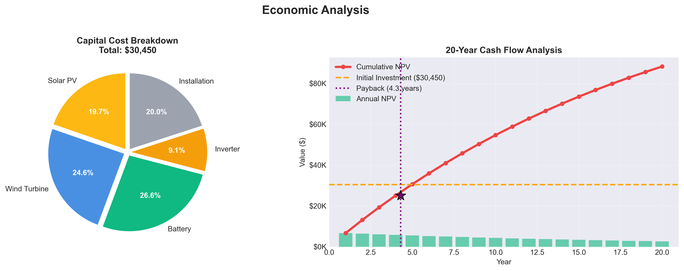

# Plots Directory

This directory contains generated visualizations from training and evaluation.

## Example Plots

The following example plots demonstrate typical outputs:

### Training Progress


4-panel analysis showing:
- Load met rate convergence
- Unmet energy reduction
- Epsilon decay (exploration → exploitation)
- Training loss with smoothing

### Hourly Performance  


4-panel analysis showing:
- Power generation and demand profiles
- Battery state of charge throughout day
- Hourly load coverage
- System resilience scores

### Evaluation Results


2-panel analysis showing:
- Load coverage distribution across scenarios
- Performance by load type (residential/commercial/mixed)

### Economic Analysis


2-panel analysis showing:
- Capital cost breakdown by component
- 20-year cash flow with NPV and payback period

## Generating Plots

Plots are automatically generated with the `--plot` flag:

```bash
# During training
python cli.py train --episodes 1000 --plot

# During evaluation
python cli.py evaluate --auto-latest --scenarios 100 --plot

# During comparison
python cli.py compare --capacities 15 18 20 --parallel --plot
```

## File Naming Convention

```
microgrid_v7_YYYYMMDD_HHMMSS_<type>.png
```

Types:
- `progress.png`: Training progress
- `performance.png`: Hourly performance
- `evaluation.png`: Evaluation results
- `economics.png`: Economic analysis

## Format Options

By default, plots are saved as:
- **PNG**: 300 DPI for publications

## Customization

Modify `TrainingVisualizer` class in `cli.py` to customize:
- Colors and styles
- Figure sizes
- DPI settings
- Additional metrics

## Note

Generated plot files are excluded from git tracking (see `.gitignore`).
Example plots are included in the repository for documentation.
